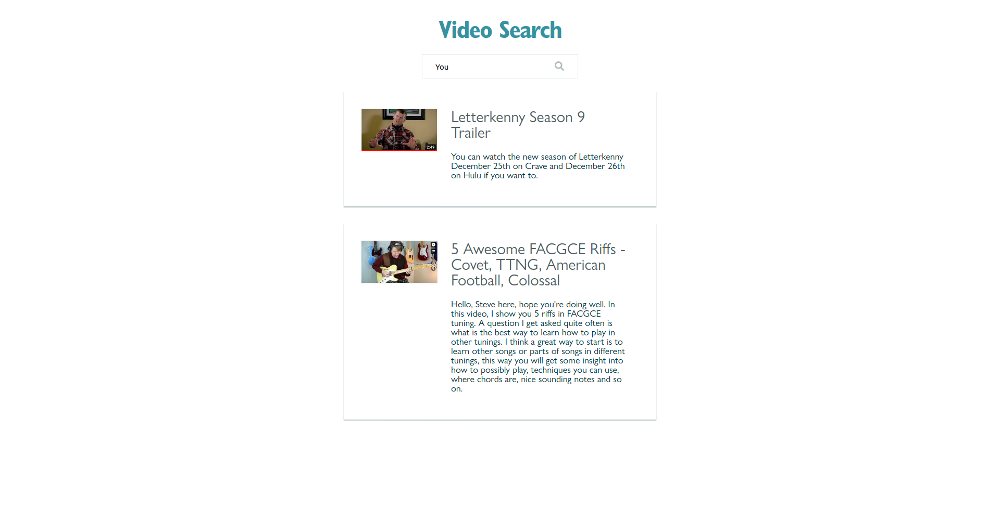

## Setup

* Requires node and Docker / Docker Compose
* Run `npm start`. You can access your running client on `http://localhost:8090` and the API for this app at `http://localhost:8091`.

## Instructions

Refactor the HTML and CSS in `frontend/App.vue` to use components and dynamically filter data based on search criteria.

* Your solution should have at least 2 new components
* Replace all hard-coded data with data from the `http://localhost:8091/videos` API endpoint.
* Video search text should match any text in the title or description, regardless of casing or whitespace. Some examples:
  * If nothing is entered, all 6 videos should display
  * Entering only the letter `x` should show "Can The Emmy's Be Hacked?" and "Progressive Web Apps Are The Future"
  * Entering `hel` should show "5 Awesome FACGCE Riffs - Covet, TTNG, American Football, Colossal", "Can the Emmy's be Hacked?", and "Progressive Web Apps Are The Future"
  * Entering `video` should show "5 Awesome FACGCE Riffs - Covet, TTNG, American Football, Colossal", and "CITRA - Air (Official Music Video)
* If no videos match the search, a message indicating that there are no matches should be displayed.
